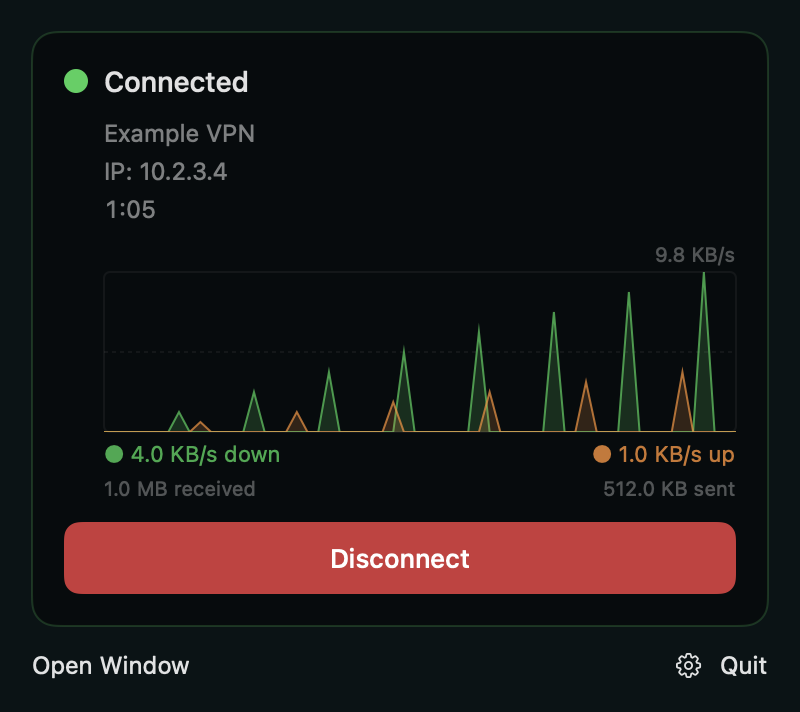
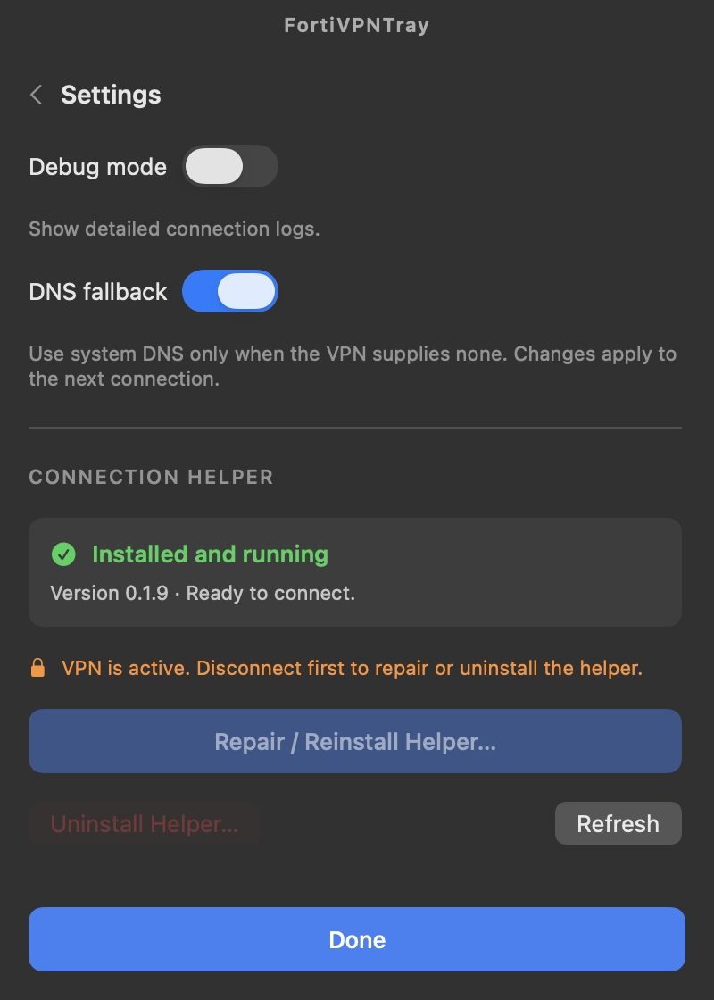

# FortiVPNTray

A lightweight, native macOS menu bar client for [openfortivpn](https://github.com/adrienverge/openfortivpn), built with **SwiftUI and AppKit**.

Connect with a password or SAML, close the window, and keep your VPN in the menu bar.

[Build details](native/README.md) · [MIT license](LICENSE)

<p align="center">
  
  
</p>

*Screenshots use simulated connection data.*

## Features

- **Menu bar first:** closing the window removes the running Dock icon while the VPN stays connected. Reopen it from the menu bar.
- **Visible connection state:** a green filled checkmark shield when connected, an outline shield when disconnected, and distinct connecting/error icons.
- **Live traffic:** VPN IP, connection duration, download/upload rates, session totals and a two-minute traffic chart in both the window and tray popover.
- **Multiple profiles:** password and browser-based SAML authentication, optional realms and advanced arguments.
- **macOS Keychain:** saved passwords stay in Keychain, not in profile JSON files.
- **Certificate controls:** SHA256 certificate pins and a confirmation flow for untrusted gateways.
- **DNS fallback:** system DNS is used only when enabled and the VPN provides none.
- **Helper management:** explicit installation/version status, verified install/removal feedback and administrator authorization.
- **Connection logs:** bounded logs with credential and URL redaction.

## Requirements

- **macOS 13 or later, Apple Silicon.** Intel builds are not currently supported.
- [Homebrew](https://brew.sh) and `openfortivpn` at `/opt/homebrew/bin/openfortivpn`.
- To build: **Swift 6+** via Xcode or Command Line Tools, plus a current stable [Rust toolchain](https://rustup.rs).

```bash
brew install openfortivpn
```

## Download and install

Download **FortiVPNTray-native-arm64.zip** from [GitHub Releases](https://github.com/itstone/FortiVPNTray/releases/latest), unzip it, and move `FortiVPNTray.app` to Applications. Install `openfortivpn` with the command above, then open the app and follow **First connection** below. The prebuilt app does not require Swift or Rust.

Releases include a `SHA256SUMS` file. To verify a download, place both files in the same directory and run:

```bash
shasum -a 256 -c SHA256SUMS
```

The app is ad-hoc signed, **not Apple-notarized**. macOS may require approval in **System Settings → Privacy & Security** before first launch. Download only from this repository's releases.

## Build and run

Clone this repository, then run from its root:

```bash
git clone https://github.com/itstone/FortiVPNTray.git
cd FortiVPNTray
native/scripts/test.sh
cargo test --manifest-path helper/Cargo.toml --locked
native/scripts/build.sh
open native/dist/FortiVPNTray.app
```

Build outputs:

- `native/dist/FortiVPNTray.app`
- `native/dist/FortiVPNTray-native-arm64.zip`

The build script compiles the Swift client and Rust helper, bundles the icon and license, and applies a local **ad-hoc signature**. The app is **not Apple-notarized**. Node.js and npm are not required.

If the selected Xcode installation is unavailable, select an installed Command Line Tools toolchain for the command, for example:

```bash
DEVELOPER_DIR=/Library/Developer/CommandLineTools native/scripts/build.sh
```

The [native CI workflow](.github/workflows/native.yml) tests and builds the Apple Silicon app and uploads its ZIP as a workflow artifact. Version tags publish the tested ZIP and SHA256 checksums to GitHub Releases. There is no Homebrew cask.

## First connection

1. Open **Settings** and choose **Install Helper…**. Approve the macOS administrator prompt, then wait for **Installed and running**.
2. Create a profile with the gateway host/port and select **Password** or **SAML**. For password authentication, save your username and password; SAML opens your browser when connecting.
3. Select the profile and click **Connect**. If asked to trust a certificate, verify its SHA256 fingerprint with your administrator.
4. Close the window to keep the VPN in the menu bar. Click the tray icon for statistics and **Disconnect**; **Open Window** restores the window and Dock icon.

**Quit** disconnects the active session before exiting. Repairing or uninstalling the helper requires disconnecting first; refreshing its status is available while connected. Uninstalling the helper preserves profiles and saved passwords.

## Architecture and data

| Component | Implementation |
| --- | --- |
| Desktop window and tray | SwiftUI + AppKit in `native/` |
| Configuration, Keychain, logs and session control | Swift `FortiVPNCore` |
| Privileged connection service | Standalone Rust crate in `helper/` |
| VPN protocol engine | External `openfortivpn` |

The helper runs with administrator privileges to manage the VPN process and network configuration. The helper executable is `openvpngui-helper`; the desktop client is Swift.

- App/configuration/Keychain identifier: `com.itstone.fortivpntray`.
- Helper service: `com.itstone.fortivpntray.helper`.
- Helper socket: `/var/run/fortivpntray-helper.sock`.
- Helper log: `/var/log/fortivpntray-helper.log`.

Run only one FortiVPNTray instance, and do not connect another VPN client concurrently: the helper manages system PPP interfaces, DNS and routes.

## Development and validation

Open `native/Package.swift` in Xcode, or use the scripts above. Always use `native/scripts/build.sh` when producing a complete app bundle with its helper.

An isolated UI smoke check is available in a logged-in macOS desktop session:

```bash
native/dist/FortiVPNTray.app/Contents/MacOS/FortiVPNTray --smoke-test
```

It uses temporary configuration and simulated telemetry, checks window/tray/Dock behavior, and exits automatically without contacting the live helper. Core tests use a mock helper socket and a disposable Keychain item. They do not establish a real VPN connection.

Automated tests and builds do not replace testing against your password/SAML gateway, corporate DNS, sleep/wake behavior or macOS version. See [native/README.md](native/README.md) for validation details.

## Contributing

Bug reports and focused pull requests are welcome. Submit changes through a fork and pull request; all changes to this repository are reviewed and merged by the maintainer, **@itstone**. Include your macOS version, chip, authentication type, steps to reproduce and expected behavior. Remove credentials, SAML URLs/tokens, gateway addresses and other private details from logs before sharing them. Include relevant tests for behavior changes and describe what you tested manually.

## Credits and license

FortiVPNTray is a native Swift rewrite derived from **[OpenFortiVpn Connect](https://github.com/walcew/openfortivpn-connect)** by **Wallacy Santos Ferreira**. It retains the original MIT attribution and connection helper. The VPN engine is **[openfortivpn](https://github.com/adrienverge/openfortivpn)** by Adrien Vergé and contributors. The original profile-oriented interface was inspired by OpenVPN Connect.

This repository is licensed under the **[MIT License](LICENSE)**. External dependencies retain their own licenses.

This project is independent and is not affiliated with or endorsed by Fortinet, FortiClient, FortiGate or OpenVPN. Product names and trademarks belong to their respective owners.
